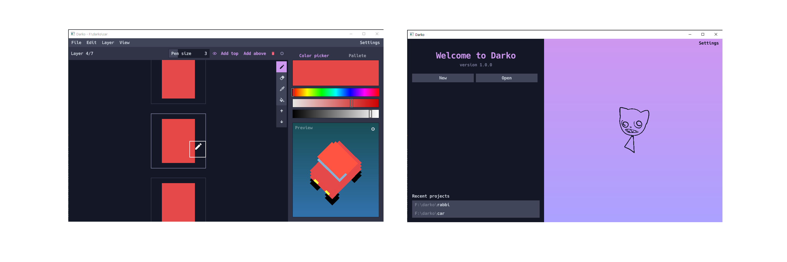

## Darko
Make 3D pixels using Sprite Stacking

## Features
- Pen, Eraser, Fill, Color Picker
- Color Pallettes
- Full Undo Redo 
- UI scaling
- Saving / Exporting

## Building
- Current odin version i use is dev-2025-04-nightly:990cc56
- Clone the repository recursively
- On the command line run `build debug` or `build release`

## Supported platforms
It’s tested only on windows, linux *might* work but you have to build it yourself

## Shortcuts
- Common
  - `CTRL + N` create new project
  - `CTRL + O` open project
  - `CTRL + =` zoom in ui
  - `CTRL + -` zoom out ui

- Project view
  - Tools
    - `P` switch to Pen tool
    - `E` switch to Eraser tool
    - `I` or `Hold CTRL` switch to Color picker
    - `B` switch to Bucket fill

  - Layer
    - `SPACE` create new layer above the current
    - `CTRL + SPACE` create new layer at the top
    - `D` duplicate layer
    - `F` clear current layer
    - `X` delete current layer
    -  `ALT + UP` move layer up
    -  `ALT + DOWN` move layer down
    -  `CTRL + LEFT` translate layer to left 
    -  `CTRL + RIGHT` translate layer to right 
    -  `CTRL + DOWN` translate layer to down 
    -  `CTRL + UP` translate layer to up
    
  - Movement
    - `UP` go to next layer
    - `DOWN` go to previous layer
    - `Hold SHIFT` switch to Go to mode
      
  - Project
    -  `CTRL + S` save project
    -  `CTRL + E` export project
  
  - Edit
    -  `CTRL + Z` undo
    -  `CTRL + Y` redo
    -  `CTRL + C` copy layer
    -  `CTRL + Y` paste layer

  - View
    - `TAB` toggle onion skinning

  - Other
    - `W` go to welcome screen
    
- Welcome view
  - `1..9` go to nth recent project
